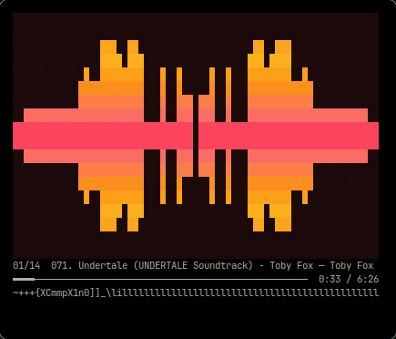
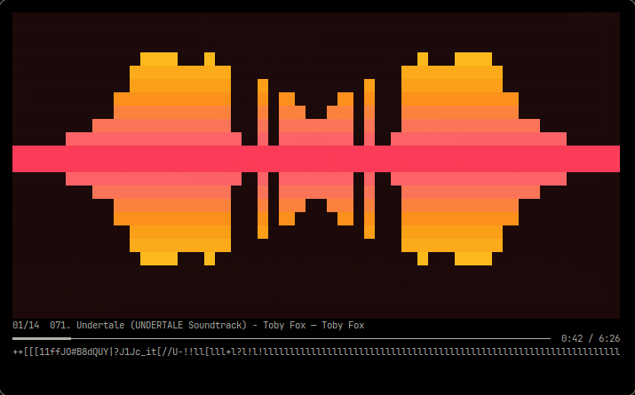
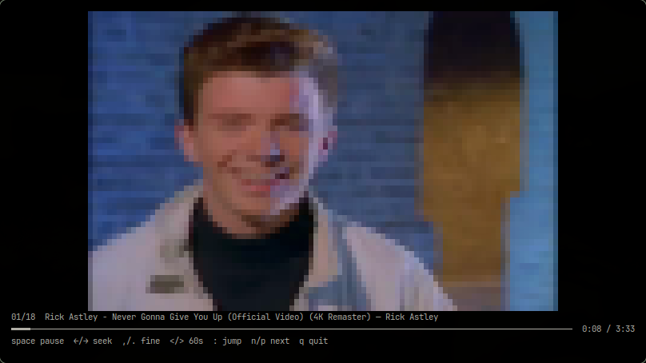

<div align="center">

<pre>
▛▀▖      ▐        ▛▀▖      
▙▄▘▝▀▖▞▀▘▜▀ ▞▀▖▙▀▖▙▄▘▝▀▖▙▀▖
▌▚ ▞▀▌▝▀▖▐ ▖▛▀ ▌  ▌ ▌▞▀▌▌  
▘ ▘▝▀▘▀▀  ▀ ▝▀▘▘  ▀▀ ▝▀▘▘  
</pre>

# RasterBar

**A YouTube player that lives in your terminal.**
ASCII video, or a music visualiser with ten gradient palettes — in one static
binary with **zero third-party Go modules**.

</div>

---

<p align="center">
  
  
</p>

<p align="center"><sub>
  <code>mirror</code> visualiser, two terminal widths. The strip under the progress
  bar is the live spectrum; the chrome is the HUD.
</sub></p>

---

<p align="center">
  
</p>

<p align="center"><sub>
  <strong>Video mode</strong> (<code>-a</code>) — the picture rendered into the cell grid in
  colour, with the HUD and key hints below it. The visualiser screenshots above are
  <strong>music mode</strong>, which has no video at all.
</sub></p>

---

## What it is

You point it at a search, a URL, or a folder. It plays the audio through `mpv`
and paints the picture itself, straight into the terminal's cell grid — colour,
half-blocks, diff-rendered so only the cells that changed get written.

Two modes, one player:

| | |
|---|---|
| **`-M` music mode** *(default)* | no video. Six audio-reacting visualisers, ten palettes, beat detection. |
| **`-a` video mode** | ASCII or truecolour video, with the spectrum strip under the picture. |

## Visualisers

`v` and `V` walk them; `--viz NAME` picks one at startup.

| name | what it does |
|---|---|
| `bars` | the classic. Bars grow from the baseline, peak caps hold the top. |
| `scope` | a waveform trace, aspect-corrected so it's a line and not a smear. |
| `mirror` | mirrored around the centreline — the wings in the screenshots. |
| `waterfall` | a scrolling spectrogram. Newest row on top, fading with age. |
| `radial` | one spoke per frequency band, fanning out from the centre. |
| `particles` | dots launched on transients and integrated with momentum. |

## Palettes

`c` cycles. `1`–`9` and `0` pick one outright.

| key | palette | gradient runs on |
|:---:|---|---|
| 1 | `spectrum` | frequency — bass red → treble violet |
| 2 | `height` | cell value, so every bar is a gradient of its own length |
| 3 | `ocean` | frequency, narrow cyan→blue. Quiet on a dark terminal. |
| 4 | `ember` | frequency, warm red→orange. Transients read as heat. |
| 5 | `graphite` | cell value, **pure greyscale** |
| 6 | `ink` | frequency, **pure greyscale** — bass black, treble white |
| 7 | `ice` | cell value, deep navy → near-white |
| 8 | `magma` | cell value, black → red → orange → yellow |
| 9 | `viridis` | both, dark purple → teal → yellow |
| 0 | `mono` | none — no colour at all. Deliberately last. |

Every one is a gradient. The two greyscale ones are *not* `--mono`: they return
`r==g==b` from the same colour path, which is what lets them carry a real
luminance ramp instead of a flat fill.

## Install

All the code lives in `src/`, so the installable package path is the module path
plus `src` — and Go names the binary after the last element, so this one calls
itself `src`:

```sh
go install github.com/vspcoderz/rasterbar/src@latest
```

Building it yourself is the better route if you want the binary called
`rasterbar`, and it is what the release notes use:

```sh
git clone https://github.com/vspcoderz/RasterBar
cd RasterBar
go build -ldflags="-s -w" -o rasterbar ./src
```

**Requires** `ffmpeg` and `mpv` on `$PATH`. Searching YouTube additionally wants
`yt-dlp` and `ytfzf`.

## Use

```sh
rasterbar "lofi hip hop radio"     # search and play
rasterbar https://youtu.be/...    # a URL
rasterbar -a -c "tesseract"        # ASCII/colour video mode
```

Or point it at files instead of a search:

```sh
rasterbar track.mp3 prelude.opus   # these files, in this order
rasterbar ~/Music/*.flac           # a glob
rasterbar roadtrip.m3u             # an m3u/m3u8 playlist
rasterbar -l ~/Shows --play        # browse a folder, start immediately
```

An argument is treated as a file when it exists, contains a wildcard, or names a
playlist — anything else is a YouTube search, so `"lofi hip hop radio"` still
does what it looks like. A file with no video stream plays as a visualiser no
matter which mode you asked for, since there is no picture to show.

`-l` orders a directory two ways at once: files with an episode marker sort
series → season → episode, and files without one sort by natural filename order,
so `track 2` comes before `track 10`. That is what makes a music folder browsable
here rather than invisible.

### Keys while playing

| key | |
|---|---|
| `space` | pause / resume |
| `←` `→` | seek ∓10s |
| `,` `.` | seek ∓1s |
| `<` `>` | seek ∓60s |
| `[` `]` | previous / next chapter |
| `:` | jump to a timestamp |
| `n` `p` | next / previous track |
| `+` `-` | volume |
| `s` | toggle the spectrum strip |
| `q` / `ctrl-c` | quit |

Music mode only — there is no visualiser in video mode:

| key | |
|---|---|
| `v` `V` | next / previous visualiser |
| `c` | next palette |
| `1`–`9` `0` | pick a palette directly |
| `W` | split view: video beside the visualiser (off by default) |
| `a` `d` | move the video pane left / right |
| `T` | video pane: still thumbnail / live video |
| `{` `}` | move the split divider |

### Keys while browsing

| key | |
|---|---|
| `j` `k` / arrows | move |
| `g` `G` | top / bottom |
| `1`–`9` | jump to row |
| `enter` | play in music mode |
| `a` | play in video mode |

The `:` prompt takes `1:30`, `1:02:03`, a bare `90` (seconds), `90s` / `2m` /
`1h2m3s`, `+30` / `-1:30` relative to now, and `50%` of the track. It previews
where the jump will land before you commit.

### Split view

In music mode, `W` puts the video beside the visualiser instead of replacing it —
a second pane, on whichever side you want, with `{` and `}` moving the divider.
It is off by default because it costs a second ffmpeg and half the grid.

`T` swaps the pane between live video and the still thumbnail that `yt-dlp` already
returned in a response the player had already made, so the still costs no extra
request and no video stream at all.

## Notable

**Zero third-party Go modules.** The FFT, the PTY, raw mode and termios are all
hand-rolled. That's the project's defining constraint, not a preference — each
dependency would have been a few dozen lines of syscall or arithmetic, and a
player you can `go install` and trust is worth more than one with a module graph.

**The renderer diffs.** Repainting the whole grid every frame cost ~11KB at
200×57 and made the terminal, not the CPU, the bottleneck. Writes are grouped into
per-row runs so a changed cell costs a cursor move and a few characters.

**The spectrum is calibrated against real music.** The band levels are
unnormalised FFT magnitudes carrying a measured +44.2dB offset, and the noise
gate tests shape *and* level on the raw bands before any normalisation. Both
earlier versions of that gate passed on synthesised tones and were wrong on music
— the tones read mean/max 0.04–0.11 where real tracks read 0.42–0.80.

**It fits your terminal.** Grid width, height, source resolution and frame rate
are all derived from the window size, so a small window doesn't ask ffmpeg for a
4K stream. `TIOCGWINSZ` is watched, and a resize rebuilds the decoder.

**Video is letterboxed, not stretched.** The picture keeps its own proportions
whatever shape your window is. It didn't used to: the filter scaled straight to
the cell grid, so a square in a 16:9 frame rendered 0.57:1 on screen — squashed
by 43%, which is invisible in a shot and glaring in a title card.

**Frames are presented atomically.** Every frame is wrapped in DEC mode 2026, so
the terminal shows a finished picture rather than a half-painted one. Terminals
that don't implement it ignore it.

## License

MIT — see [LICENSE](LICENSE).